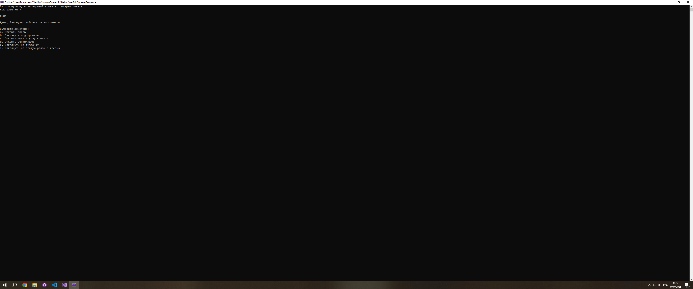
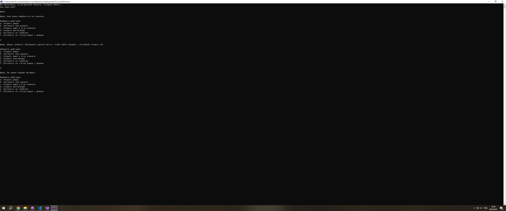

# **ConsoleGameProject**

## Текстовая консольная игра

### Описание игры

В этой игре необходимо выбраться из комнаты, используя варианты действий из списка.

### Использование

* Запустите консоль.

* Используя ввод текста в консоль, выбирайте действия.

* Наслаждайтесь игрой.
